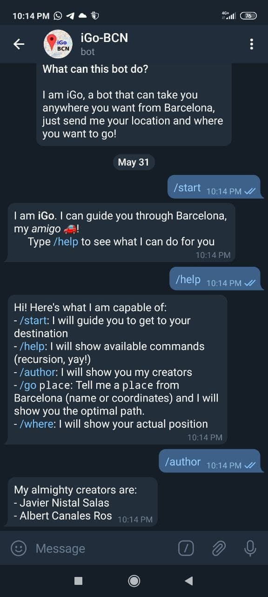
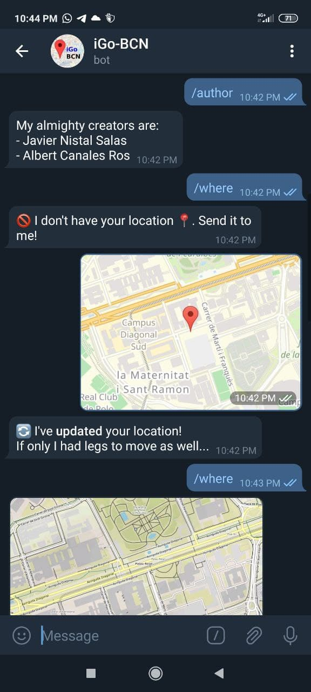
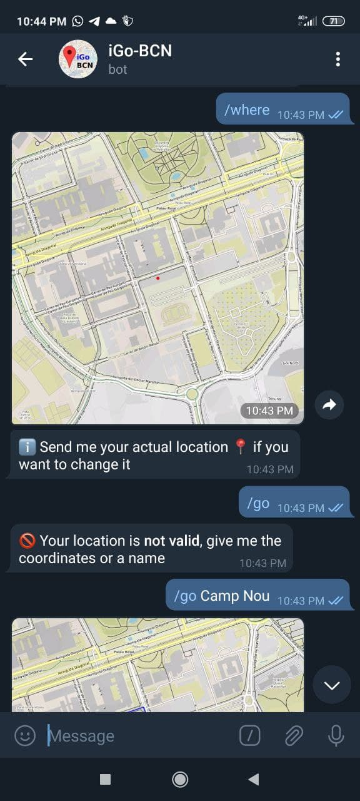
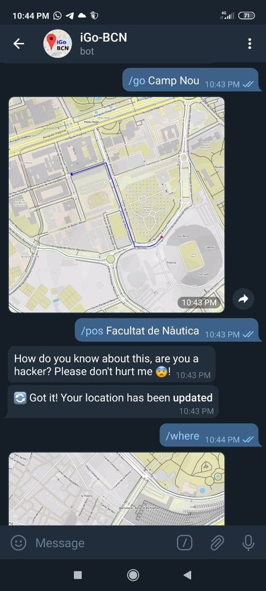
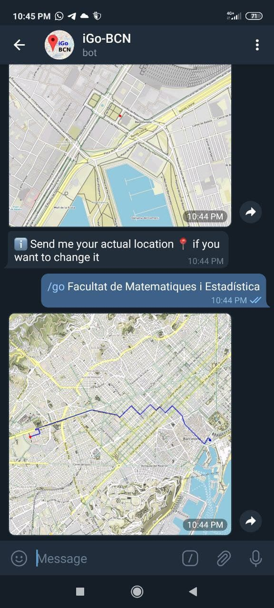

# iGo-BCN
## By Javier Nistal Salas i Albert Canales Ros

iGo-BCN is a Telegram bot that guides you through Barcelona. The project is composed by two files: `igo.py` and `bot.py`, described on the next sections.

## igo.py

The file `igo.py` has the purpose of managing the iGraph from Barcelona. At the beggining of the code, it contains some string constants for managing the input and some named tuples with the same purpose.

But most importantly it contains the class iGraph. When initialized, the necessary data for iGraph is downloaded (or loaded from cache if possible) and it is saved on the private attribute `igraph`.

The API offers the following methods:

-  get_shortest_path(source_loc, target_loc, filename): Given two locations, it finds the optimal path from the first to the second using the `itime`. If given a file name, it will also save an image of the path using it.

- get_location(string): Given coordinates or a name of a place, it will return the location corresponding to the nearest node from that position.

- plot_graph(save=True): It plots the iGraph using the method from osmnx. If `save`, it also saves the image.

- get_location_map(location, filename): Saves an image of a map with a mark on `location` with the name `filename`.

Our implementation includes a couple of features that very much improve the efficiency of the code and its use:

- Both the graph and the highways are stored in cache, resulting in a much more faster initiallization of the iGraph. In the case of highways, much computation time is reduced by saving the corresponding id's instead of the coordinates, and avoiding recalculations.

- Periodically, the content from congestions is updated from the Internet, and the values for itime are recalculated.

## bot.py

The file `bot.py` offers a Telegram bot that enables the user to interact with the methods from iGraph. It requires a file `token.txt` with the bot token. It also has two global variables, `igraph`, which contains an instance of an iGraph, and `locations`, a dictionary with the saved location for each user.

The functions `start`, `help`, `author`, `go`, `where` and `pos` refer to commands interpreted by the bot, their purpose can be found on `/help`. The function `set_location` is called when a location is sent by the user. It then changes the user location to the one given.

Some auxiliary functions are used in order to send messages, maps, etc. with the aim of simplifying the command functions.

Here is an example of an interaction with the bot:

 

 

